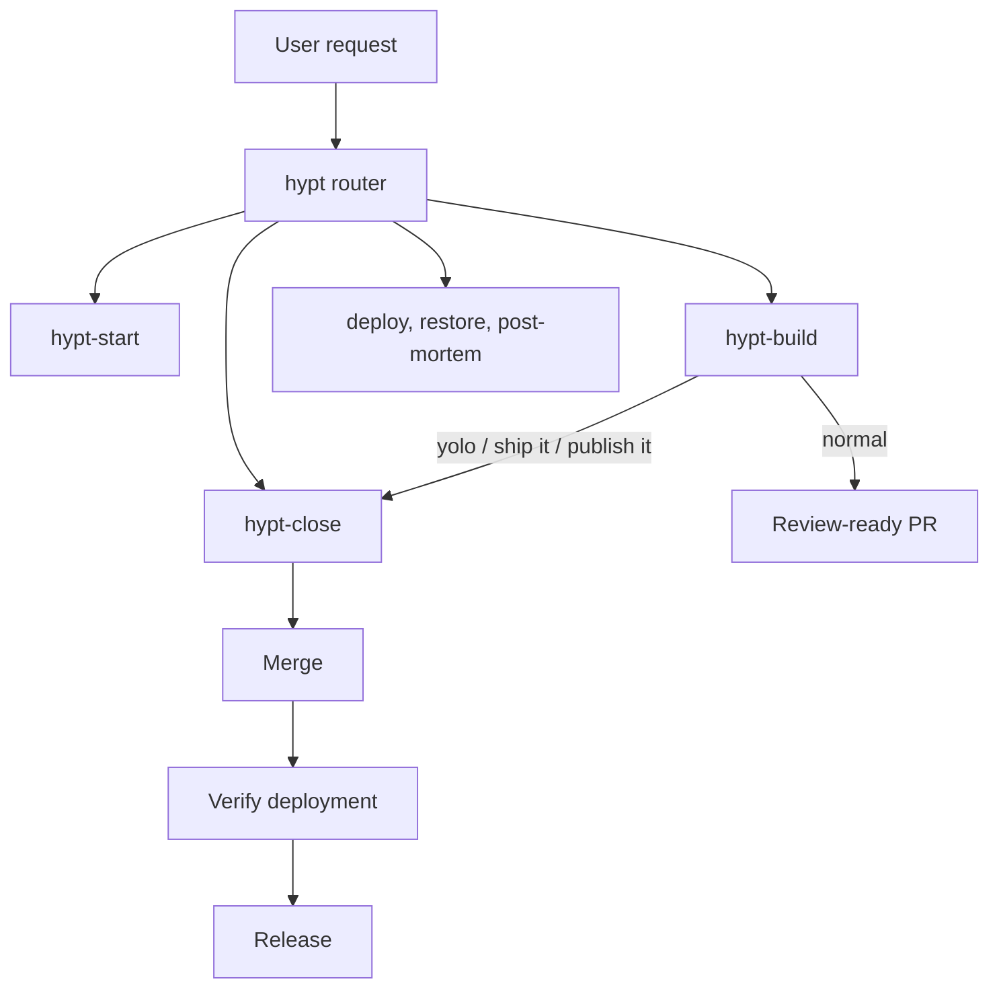
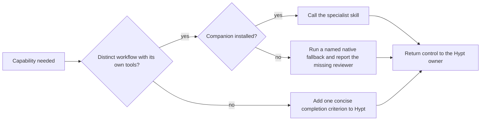

# Agent skill landscape research

## Outcome

Hypt should remain a small lifecycle orchestrator rather than absorb this ecosystem as new wrapper skills. The strongest direction is:

1. Keep `hypt-build` and `hypt-close` as the two shipping owners.
2. Install the small required companion set during `hypt-start`, then call those specialists only at clear seams.
3. Glean small, portable completion criteria from external skills when a dependency would add more installation and cognitive load than value.
4. Treat `yolo`, `ship it`, and `publish it` as routing phrases: `hypt-build` prepares the work, then hands it to `hypt-close` with its confirmation gate pre-approved.

This branch removes `hypt-go`, `hypt-yolo`, `hypt-autoclose`, and the redundant `hypt-prototype`; adds the focused, model-invoked `hypt-implement` seam; updates active references; and keeps historical changelog entries unchanged.

The repository now has **9 Hypt skills**. This research inventories **101 skills** across Hypt, Matt Pocock, Poteto/pstack, HumanLayer, Archify, and the local `balto-build`.



## Scope and primary sources

| Source | Snapshot | Included |
|---|---|---:|
| [Hypt](https://github.com/brianevanmiller/hypt-builder) | This branch on 2026-08-27 | 9 |
| [Matt Pocock skills](https://github.com/mattpocock/skills/tree/6654f6b60cd9d5be8b54c6fafe44346dabeb3b76/skills) | `6654f6b60cd9d5be8b54c6fafe44346dabeb3b76` | 37 |
| [Cursor pstack subtree](https://github.com/cursor/plugins/tree/799151d91b6e12ee7dbd09f708eec108d7de9b3b/pstack) | `799151d91b6e12ee7dbd09f708eec108d7de9b3b` | 48 |
| [HumanLayer skills](https://github.com/humanlayer/skills/tree/3c2629142c5d437428269b1b722b08c0b87f574d/plugins) | `3c2629142c5d437428269b1b722b08c0b87f574d` | 5 |
| [Archify](https://github.com/tt-a1i/archify/tree/9a5060566c832832fb843e457e58c8ee6bac82fd/archify) | `9a5060566c832832fb843e457e58c8ee6bac82fd` | 1 |
| Local `balto-build` | `~/.agents/skills/balto-build/SKILL.md`, read 2026-08-27 | 1 |
| **Total** | | **101** |

The inventory uses each skill's own frontmatter and body as the primary source. The pstack count includes its three Benny automation-only skills. Matt Pocock's `in-progress` directory is included because those entries are installable `SKILL.md` packages, but their location is a stability warning. The local `balto-build` source is not versioned by a cited public repository, so its row records the local snapshot rather than implying a durable URL.

Skill names in the analysis tables below refer back to the pinned source links in the master inventory.

## Current Hypt inventory

| Skill | One-line purpose |
|---|---|
| [`hypt`](../agents/skills/hypt/SKILL.md) | Routes requests across the Hypt shipping lifecycle. |
| [`hypt-start`](../agents/skills/hypt-start/SKILL.md) | Onboards a project and owner, installs required companions, sets up accounts, and creates a build plan. |
| [`hypt-plan-critic`](../agents/skills/hypt-plan-critic/SKILL.md) | Stress-tests a non-trivial implementation plan for gaps and risks. |
| [`hypt-implement`](../agents/skills/hypt-implement/SKILL.md) | Implements approved work as a focused coding pass behind `hypt-build`. |
| [`hypt-build`](../agents/skills/hypt-build/SKILL.md) | Routes readiness, implements, proves, and reviews work through a remote PR, or continues through close in yolo mode. |
| [`hypt-close`](../agents/skills/hypt-close/SKILL.md) | Refreshes and verifies a ready PR, merges it, confirms deployment, and creates a release. |
| [`hypt-deploy`](../agents/skills/hypt-deploy/SKILL.md) | Checks deployment health and remediates supported deployment failures. |
| [`hypt-restore`](../agents/skills/hypt-restore/SKILL.md) | Restores a prior working release through platform rollback, code revert, or database recovery. |
| [`hypt-post-mortem`](../agents/skills/hypt-post-mortem/SKILL.md) | Investigates a production incident and records follow-up work. |

## Master inventory

The Hypt table above is the first 9 entries in the 101-skill master list. The remaining 92 follow.

### Matt Pocock (37)

| Skill | One-line purpose |
|---|---|
| [`ask-matt`](https://github.com/mattpocock/skills/blob/6654f6b60cd9d5be8b54c6fafe44346dabeb3b76/skills/engineering/ask-matt/SKILL.md) | Routes a situation to an appropriate skill or flow. |
| [`code-review`](https://github.com/mattpocock/skills/blob/6654f6b60cd9d5be8b54c6fafe44346dabeb3b76/skills/engineering/code-review/SKILL.md) | Reviews a diff in parallel against repository standards and the originating spec. |
| [`codebase-design`](https://github.com/mattpocock/skills/blob/6654f6b60cd9d5be8b54c6fafe44346dabeb3b76/skills/engineering/codebase-design/SKILL.md) | Supplies a shared vocabulary for deep modules, interfaces, seams, and testability. |
| [`diagnosing-bugs`](https://github.com/mattpocock/skills/blob/6654f6b60cd9d5be8b54c6fafe44346dabeb3b76/skills/engineering/diagnosing-bugs/SKILL.md) | Runs a structured diagnosis loop for hard bugs and performance regressions. |
| [`domain-modeling`](https://github.com/mattpocock/skills/blob/6654f6b60cd9d5be8b54c6fafe44346dabeb3b76/skills/engineering/domain-modeling/SKILL.md) | Sharpens project terminology, domain models, context documents, and ADRs. |
| [`grill-with-docs`](https://github.com/mattpocock/skills/blob/6654f6b60cd9d5be8b54c6fafe44346dabeb3b76/skills/engineering/grill-with-docs/SKILL.md) | Stress-tests a plan or design interactively while recording ADRs and glossary terms. |
| [`implement`](https://github.com/mattpocock/skills/blob/6654f6b60cd9d5be8b54c6fafe44346dabeb3b76/skills/engineering/implement/SKILL.md) | Implements work from a specification or set of tickets. |
| [`improve-codebase-architecture`](https://github.com/mattpocock/skills/blob/6654f6b60cd9d5be8b54c6fafe44346dabeb3b76/skills/engineering/improve-codebase-architecture/SKILL.md) | Finds deepening opportunities, presents them visually, and grills the selected change. |
| [`prototype`](https://github.com/mattpocock/skills/blob/6654f6b60cd9d5be8b54c6fafe44346dabeb3b76/skills/engineering/prototype/SKILL.md) | Builds a deliberately throwaway prototype to answer a design question. |
| [`research`](https://github.com/mattpocock/skills/blob/6654f6b60cd9d5be8b54c6fafe44346dabeb3b76/skills/engineering/research/SKILL.md) | Delegates primary-source research and saves cited findings in the repository. |
| [`resolving-merge-conflicts`](https://github.com/mattpocock/skills/blob/6654f6b60cd9d5be8b54c6fafe44346dabeb3b76/skills/engineering/resolving-merge-conflicts/SKILL.md) | Resolves an in-progress Git merge or rebase conflict. |
| [`setup-matt-pocock-skills`](https://github.com/mattpocock/skills/blob/6654f6b60cd9d5be8b54c6fafe44346dabeb3b76/skills/engineering/setup-matt-pocock-skills/SKILL.md) | Configures issue tracking, triage vocabulary, and domain-document layout for the suite. |
| [`tdd`](https://github.com/mattpocock/skills/blob/6654f6b60cd9d5be8b54c6fafe44346dabeb3b76/skills/engineering/tdd/SKILL.md) | Implements features or fixes through a test-first red-green-refactor loop. |
| [`to-spec`](https://github.com/mattpocock/skills/blob/6654f6b60cd9d5be8b54c6fafe44346dabeb3b76/skills/engineering/to-spec/SKILL.md) | Synthesizes the current conversation into a specification and publishes it to the tracker. |
| [`to-tickets`](https://github.com/mattpocock/skills/blob/6654f6b60cd9d5be8b54c6fafe44346dabeb3b76/skills/engineering/to-tickets/SKILL.md) | Breaks a plan or spec into dependency-aware tracer-bullet tickets. |
| [`triage`](https://github.com/mattpocock/skills/blob/6654f6b60cd9d5be8b54c6fafe44346dabeb3b76/skills/engineering/triage/SKILL.md) | Moves issues and external PRs through verification, categorization, and agent-ready briefing. |
| [`wayfinder`](https://github.com/mattpocock/skills/blob/6654f6b60cd9d5be8b54c6fafe44346dabeb3b76/skills/engineering/wayfinder/SKILL.md) | Maps work too large for one session into decision tickets and resolves the path incrementally. |
| [`wizard`](https://github.com/mattpocock/skills/blob/6654f6b60cd9d5be8b54c6fafe44346dabeb3b76/skills/engineering/wizard/SKILL.md) | Generates an interactive shell wizard for human-only setup, credential, or cutover steps. |
| [`claude-handoff`](https://github.com/mattpocock/skills/blob/6654f6b60cd9d5be8b54c6fafe44346dabeb3b76/skills/in-progress/claude-handoff/SKILL.md) | Hands the current conversation to a fresh background agent that resumes immediately. |
| [`implement-spec`](https://github.com/mattpocock/skills/blob/6654f6b60cd9d5be8b54c6fafe44346dabeb3b76/skills/in-progress/implement-spec/SKILL.md) | Implements a specification in code. |
| [`loop-me`](https://github.com/mattpocock/skills/blob/6654f6b60cd9d5be8b54c6fafe44346dabeb3b76/skills/in-progress/loop-me/SKILL.md) | Interviews the user about workflow specifications within the workspace. |
| [`retro`](https://github.com/mattpocock/skills/blob/6654f6b60cd9d5be8b54c6fafe44346dabeb3b76/skills/in-progress/retro/SKILL.md) | Conducts a retrospective on a coding session. |
| [`setup-ts-deep-modules`](https://github.com/mattpocock/skills/blob/6654f6b60cd9d5be8b54c6fafe44346dabeb3b76/skills/in-progress/setup-ts-deep-modules/SKILL.md) | Enforces TypeScript package entry points and hidden implementation with dependency-cruiser. |
| [`writing-beats`](https://github.com/mattpocock/skills/blob/6654f6b60cd9d5be8b54c6fafe44346dabeb3b76/skills/in-progress/writing-beats/SKILL.md) | Assembles raw material into a grounded journey of narrative beats. |
| [`writing-fragments`](https://github.com/mattpocock/skills/blob/6654f6b60cd9d5be8b54c6fafe44346dabeb3b76/skills/in-progress/writing-fragments/SKILL.md) | Mines raw writing fragments without imposing structure. |
| [`writing-shape`](https://github.com/mattpocock/skills/blob/6654f6b60cd9d5be8b54c6fafe44346dabeb3b76/skills/in-progress/writing-shape/SKILL.md) | Shapes raw material into an article one paragraph at a time. |
| [`git-guardrails-claude-code`](https://github.com/mattpocock/skills/blob/6654f6b60cd9d5be8b54c6fafe44346dabeb3b76/skills/misc/git-guardrails-claude-code/SKILL.md) | Installs Claude Code hooks that block dangerous Git commands. |
| [`migrate-to-shoehorn`](https://github.com/mattpocock/skills/blob/6654f6b60cd9d5be8b54c6fafe44346dabeb3b76/skills/misc/migrate-to-shoehorn/SKILL.md) | Replaces test-data type assertions with `@total-typescript/shoehorn`. |
| [`scaffold-exercises`](https://github.com/mattpocock/skills/blob/6654f6b60cd9d5be8b54c6fafe44346dabeb3b76/skills/misc/scaffold-exercises/SKILL.md) | Creates lint-clean course exercise, problem, solution, and explainer structures. |
| [`setup-pre-commit`](https://github.com/mattpocock/skills/blob/6654f6b60cd9d5be8b54c6fafe44346dabeb3b76/skills/misc/setup-pre-commit/SKILL.md) | Sets up Husky and lint-staged for formatting, types, and tests before commits. |
| [`grill-me`](https://github.com/mattpocock/skills/blob/6654f6b60cd9d5be8b54c6fafe44346dabeb3b76/skills/productivity/grill-me/SKILL.md) | Relentlessly interviews the user to sharpen a plan or design. |
| [`grilling`](https://github.com/mattpocock/skills/blob/6654f6b60cd9d5be8b54c6fafe44346dabeb3b76/skills/productivity/grilling/SKILL.md) | Stress-tests a plan, decision, or idea through a relentless interview. |
| [`handoff`](https://github.com/mattpocock/skills/blob/6654f6b60cd9d5be8b54c6fafe44346dabeb3b76/skills/productivity/handoff/SKILL.md) | Compacts the current conversation into a handoff document for another agent. |
| [`teach`](https://github.com/mattpocock/skills/blob/6654f6b60cd9d5be8b54c6fafe44346dabeb3b76/skills/productivity/teach/SKILL.md) | Teaches the user a skill or concept in the current workspace. |
| [`to-questionnaire`](https://github.com/mattpocock/skills/blob/6654f6b60cd9d5be8b54c6fafe44346dabeb3b76/skills/productivity/to-questionnaire/SKILL.md) | Converts an unresolved decision into a questionnaire for the right human. |
| [`wait-what`](https://github.com/mattpocock/skills/blob/6654f6b60cd9d5be8b54c6fafe44346dabeb3b76/skills/productivity/wait-what/SKILL.md) | Re-pitches an explanation that did not land. |
| [`writing-for-agents`](https://github.com/mattpocock/skills/blob/6654f6b60cd9d5be8b54c6fafe44346dabeb3b76/skills/productivity/writing-for-agents/SKILL.md) | Guides the design of reliable skills and agent instruction files. |

### Poteto / pstack (48)

| Skill | One-line purpose |
|---|---|
| [`reproduce-and-fix-issues`](https://github.com/cursor/plugins/blob/799151d91b6e12ee7dbd09f708eec108d7de9b3b/pstack/automations/benny/skills/reproduce-and-fix-issues/SKILL.md) | Reproduces a triaged Slack bug and opens a bounded draft PR only after before-and-after proof. |
| [`setup-benny`](https://github.com/cursor/plugins/blob/799151d91b6e12ee7dbd09f708eec108d7de9b3b/pstack/automations/benny/skills/setup-benny/SKILL.md) | Configures Benny's Slack-to-triage-to-reproduction automation. |
| [`triage-issue-reports`](https://github.com/cursor/plugins/blob/799151d91b6e12ee7dbd09f708eec108d7de9b3b/pstack/automations/benny/skills/triage-issue-reports/SKILL.md) | Triages Slack reports with evidence, deduplication, routing, and fail-closed ticket creation. |
| [`architect`](https://github.com/cursor/plugins/blob/799151d91b6e12ee7dbd09f708eec108d7de9b3b/pstack/skills/architect/SKILL.md) | Sketches types, signatures, and module shape before implementing against the sketch. |
| [`arena`](https://github.com/cursor/plugins/blob/799151d91b6e12ee7dbd09f708eec108d7de9b3b/pstack/skills/arena/SKILL.md) | Races parallel candidates, cross-judges them, and grafts the best parts into one verified result. |
| [`automate-me`](https://github.com/cursor/plugins/blob/799151d91b6e12ee7dbd09f708eec108d7de9b3b/pstack/skills/automate-me/SKILL.md) | Captures a user's working preferences as a personal mode skill. |
| [`blast-radius`](https://github.com/cursor/plugins/blob/799151d91b6e12ee7dbd09f708eec108d7de9b3b/pstack/skills/blast-radius/SKILL.md) | Investigates what a change could break beyond the diff and proves the key safety fact with real code. |
| [`bro`](https://github.com/cursor/plugins/blob/799151d91b6e12ee7dbd09f708eec108d7de9b3b/pstack/skills/bro/SKILL.md) | Restates the previous message in plain, jargon-free language. |
| [`create-verification-skill`](https://github.com/cursor/plugins/blob/799151d91b6e12ee7dbd09f708eec108d7de9b3b/pstack/skills/create-verification-skill/SKILL.md) | Generates a project-local skill that drives and proves the app as a user would. |
| [`figure-it-out`](https://github.com/cursor/plugins/blob/799151d91b6e12ee7dbd09f708eec108d7de9b3b/pstack/skills/figure-it-out/SKILL.md) | Designs and runs an auditable playbook for large work when no narrower workflow fits. |
| [`Make Bot UI`](https://github.com/cursor/plugins/blob/799151d91b6e12ee7dbd09f708eec108d7de9b3b/pstack/skills/grokbot/make-bot-ui/SKILL.md) | Builds a UI that wakes a Grok Bot through a webhook. |
| [`how`](https://github.com/cursor/plugins/blob/799151d91b6e12ee7dbd09f708eec108d7de9b3b/pstack/skills/how/SKILL.md) | Explains architecture, runtime flow, ownership, placement, and layering. |
| [`interrogate`](https://github.com/cursor/plugins/blob/799151d91b6e12ee7dbd09f708eec108d7de9b3b/pstack/skills/interrogate/SKILL.md) | Runs an adversarial multi-model review and synthesizes consensus and disagreements. |
| [`maintain-verification-skill`](https://github.com/cursor/plugins/blob/799151d91b6e12ee7dbd09f708eec108d7de9b3b/pstack/skills/maintain-verification-skill/SKILL.md) | Reconciles a verification skill and feature map against source and a complete live pass. |
| [`no-comments`](https://github.com/cursor/plugins/blob/799151d91b6e12ee7dbd09f708eec108d7de9b3b/pstack/skills/no-comments/SKILL.md) | Removes comment and suppression debt, fixing or structurally encoding accepted constraints. |
| [`Poteto Mode`](https://github.com/cursor/plugins/blob/799151d91b6e12ee7dbd09f708eec108d7de9b3b/pstack/skills/poteto-mode/SKILL.md) | Applies Poteto's concise, subagent-heavy, simple-code, verified-work style. |
| [`principle-boundary-discipline`](https://github.com/cursor/plugins/blob/799151d91b6e12ee7dbd09f708eec108d7de9b3b/pstack/skills/principle-boundary-discipline/SKILL.md) | Concentrates validation and framework guards at boundaries while keeping core logic pure. |
| [`principle-build-the-lever`](https://github.com/cursor/plugins/blob/799151d91b6e12ee7dbd09f708eec108d7de9b3b/pstack/skills/principle-build-the-lever/SKILL.md) | Builds a reusable tool, codemod, generator, script, or skill for non-trivial repeatable work. |
| [`principle-encode-lessons-in-structure`](https://github.com/cursor/plugins/blob/799151d91b6e12ee7dbd09f708eec108d7de9b3b/pstack/skills/principle-encode-lessons-in-structure/SKILL.md) | Encodes repeated corrections in lint, metadata, runtime checks, or scripts instead of prose. |
| [`principle-exhaust-the-design-space`](https://github.com/cursor/plugins/blob/799151d91b6e12ee7dbd09f708eec108d7de9b3b/pstack/skills/principle-exhaust-the-design-space/SKILL.md) | Compares multiple prototypes before committing to a novel interaction or architecture. |
| [`principle-experience-first`](https://github.com/cursor/plugins/blob/799151d91b6e12ee7dbd09f708eec108d7de9b3b/pstack/skills/principle-experience-first/SKILL.md) | Prioritizes user delight and fewer polished features over implementation convenience. |
| [`principle-fix-root-causes`](https://github.com/cursor/plugins/blob/799151d91b6e12ee7dbd09f708eec108d7de9b3b/pstack/skills/principle-fix-root-causes/SKILL.md) | Reproduces symptoms, traces them to root causes, and avoids guards that only hide failures. |
| [`principle-foundational-thinking`](https://github.com/cursor/plugins/blob/799151d91b6e12ee7dbd09f708eec108d7de9b3b/pstack/skills/principle-foundational-thinking/SKILL.md) | Gets core types, data structures, sequencing, and shared-state assumptions right first. |
| [`principle-guard-the-context-window`](https://github.com/cursor/plugins/blob/799151d91b6e12ee7dbd09f708eec108d7de9b3b/pstack/skills/principle-guard-the-context-window/SKILL.md) | Routes bulk work to subagents and keeps only summaries in the main context. |
| [`principle-laziness-protocol`](https://github.com/cursor/plugins/blob/799151d91b6e12ee7dbd09f708eec108d7de9b3b/pstack/skills/principle-laziness-protocol/SKILL.md) | Biases refactors toward deletion and the smallest sufficient change. |
| [`principle-make-operations-idempotent`](https://github.com/cursor/plugins/blob/799151d91b6e12ee7dbd09f708eec108d7de9b3b/pstack/skills/principle-make-operations-idempotent/SKILL.md) | Makes lifecycle operations converge safely across retries, restarts, and partial runs. |
| [`principle-migrate-callers-then-delete-legacy-apis`](https://github.com/cursor/plugins/blob/799151d91b6e12ee7dbd09f708eec108d7de9b3b/pstack/skills/principle-migrate-callers-then-delete-legacy-apis/SKILL.md) | Migrates callers and removes an old internal API in the same change. |
| [`principle-minimize-reader-load`](https://github.com/cursor/plugins/blob/799151d91b6e12ee7dbd09f708eec108d7de9b3b/pstack/skills/principle-minimize-reader-load/SKILL.md) | Collapses needless layers, wrappers, hidden state, and mutable scope. |
| [`principle-model-the-domain`](https://github.com/cursor/plugins/blob/799151d91b6e12ee7dbd09f708eec108d7de9b3b/pstack/skills/principle-model-the-domain/SKILL.md) | Replaces scattered state assumptions and conditionals with explicit domain structures. |
| [`principle-never-block-on-the-human`](https://github.com/cursor/plugins/blob/799151d91b6e12ee7dbd09f708eec108d7de9b3b/pstack/skills/principle-never-block-on-the-human/SKILL.md) | Proceeds on reversible work and reserves confirmation for irreversible actions. |
| [`principle-outcome-oriented-execution`](https://github.com/cursor/plugins/blob/799151d91b6e12ee7dbd09f708eec108d7de9b3b/pstack/skills/principle-outcome-oriented-execution/SKILL.md) | Converges planned rewrites on the target without preserving throwaway compatibility states. |
| [`principle-prove-it-works`](https://github.com/cursor/plugins/blob/799151d91b6e12ee7dbd09f708eec108d7de9b3b/pstack/skills/principle-prove-it-works/SKILL.md) | Verifies the real artifact or flow rather than treating compilation or self-report as proof. |
| [`principle-redesign-from-first-principles`](https://github.com/cursor/plugins/blob/799151d91b6e12ee7dbd09f708eec108d7de9b3b/pstack/skills/principle-redesign-from-first-principles/SKILL.md) | Integrates a new requirement as if it had been foundational from the start. |
| [`principle-separate-before-serializing-shared-state`](https://github.com/cursor/plugins/blob/799151d91b6e12ee7dbd09f708eec108d7de9b3b/pstack/skills/principle-separate-before-serializing-shared-state/SKILL.md) | Eliminates shared writers before adding serialization around them. |
| [`principle-sequence-verifiable-units`](https://github.com/cursor/plugins/blob/799151d91b6e12ee7dbd09f708eec108d7de9b3b/pstack/skills/principle-sequence-verifiable-units/SKILL.md) | Breaks multi-step work into ordered units that each end in a verifiable state. |
| [`principle-subtract-before-you-add`](https://github.com/cursor/plugins/blob/799151d91b6e12ee7dbd09f708eec108d7de9b3b/pstack/skills/principle-subtract-before-you-add/SKILL.md) | Removes dead weight and redundant paths before building the replacement. |
| [`principle-type-system-discipline`](https://github.com/cursor/plugins/blob/799151d91b6e12ee7dbd09f708eec108d7de9b3b/pstack/skills/principle-type-system-discipline/SKILL.md) | Makes illegal states unrepresentable and parses external data at typed boundaries. |
| [`recall`](https://github.com/cursor/plugins/blob/799151d91b6e12ee7dbd09f708eec108d7de9b3b/pstack/skills/recall/SKILL.md) | Reconstructs recent context from chat, live state, reports, fixes, and incidents. |
| [`reflect`](https://github.com/cursor/plugins/blob/799151d91b6e12ee7dbd09f708eec108d7de9b3b/pstack/skills/reflect/SKILL.md) | Reviews the active transcript in parallel and routes lessons into concrete skill edits. |
| [`setup-pstack`](https://github.com/cursor/plugins/blob/799151d91b6e12ee7dbd09f708eec108d7de9b3b/pstack/skills/setup-pstack/SKILL.md) | Configures model choices for pstack's different worker roles. |
| [`show-me-your-work`](https://github.com/cursor/plugins/blob/799151d91b6e12ee7dbd09f708eec108d7de9b3b/pstack/skills/show-me-your-work/SKILL.md) | Maintains an evidence-linked TSV decision trail for long-running or unattended work. |
| [`swarm`](https://github.com/cursor/plugins/blob/799151d91b6e12ee7dbd09f708eec108d7de9b3b/pstack/skills/swarm/SKILL.md) | Fans work out to isolated parallel workers and aggregates one result. |
| [`tdd`](https://github.com/cursor/plugins/blob/799151d91b6e12ee7dbd09f708eec108d7de9b3b/pstack/skills/tdd/SKILL.md) | Uses a narrow failing regression test for bugs when the test path is cheap and clear. |
| [`teach`](https://github.com/cursor/plugins/blob/799151d91b6e12ee7dbd09f708eec108d7de9b3b/pstack/skills/teach/SKILL.md) | Combines runtime and rationale research into a plain explanation. |
| [`technical-writing`](https://github.com/cursor/plugins/blob/799151d91b6e12ee7dbd09f708eec108d7de9b3b/pstack/skills/technical-writing/SKILL.md) | Applies Diátaxis, Google developer style, STE, and Global English to technical writing. |
| [`typescript-best-practices`](https://github.com/cursor/plugins/blob/799151d91b6e12ee7dbd09f708eec108d7de9b3b/pstack/skills/typescript-best-practices/SKILL.md) | Applies pstack's TypeScript design and implementation rules. |
| [`unslop`](https://github.com/cursor/plugins/blob/799151d91b6e12ee7dbd09f708eec108d7de9b3b/pstack/skills/unslop/SKILL.md) | Removes recognizable AI-writing habits from prose. |
| [`why`](https://github.com/cursor/plugins/blob/799151d91b6e12ee7dbd09f708eec108d7de9b3b/pstack/skills/why/SKILL.md) | Reconstructs design rationale from source control, trackers, docs, chat, observability, and analytics. |

### HumanLayer (5)

| Skill | One-line purpose |
|---|---|
| [`build-iterated-agentic-loop`](https://github.com/humanlayer/skills/blob/3c2629142c5d437428269b1b722b08c0b87f574d/plugins/build-iterated-agentic-loop/skills/build-iterated-agentic-loop/SKILL.md) | Builds a repo-local skill plus a scheduled coding-agent GitHub Actions loop. |
| [`design-control-loop`](https://github.com/humanlayer/skills/blob/3c2629142c5d437428269b1b722b08c0b87f574d/plugins/design-control-loop/skills/design-control-loop/SKILL.md) | Designs a sensor-controller-actuator improvement loop and wires its runnable pieces into CI. |
| [`improve-claude-md`](https://github.com/humanlayer/skills/blob/3c2629142c5d437428269b1b722b08c0b87f574d/plugins/improve-claude-md/skills/improve-claude-md/SKILL.md) | Reorganizes `CLAUDE.md` rules into targeted `<important if>` blocks. |
| [`narrow-react-prop-types`](https://github.com/humanlayer/skills/blob/3c2629142c5d437428269b1b722b08c0b87f574d/plugins/narrow-react-prop-types/skills/narrow-react-prop-types/SKILL.md) | Narrows React component prop types to states supported by live call paths. |
| [`show-me`](https://github.com/humanlayer/skills/blob/3c2629142c5d437428269b1b722b08c0b87f574d/plugins/show-me/skills/show-me/SKILL.md) | Explains a topic with a minimal diagram, code-shape sketch, diff, or focused HTML artifact. |

### Archify (1)

| Skill | One-line purpose |
|---|---|
| [`archify`](https://github.com/tt-a1i/archify/blob/9a5060566c832832fb843e457e58c8ee6bac82fd/archify/SKILL.md) | Produces validated, polished, interactive architecture and workflow diagrams with export support. |

### Local (1)

| Skill | One-line purpose |
|---|---|
| `balto-build` | Routes work from raw idea, ambiguous spec, design question, partial implementation, or ready ticket through a production-grade build-and-ship loop. |

## Overlap and complement map

| Area | Hypt owner | Similar or complementary skills | Relationship | Best use |
|---|---|---|---|---|
| Lifecycle routing | `hypt` | Matt `ask-matt`; pstack `figure-it-out`; local `balto-build` | Partial overlap | Keep Hypt's router narrow; glean `balto-build`'s readiness routing rather than routing every engineering task. |
| Idea and scope discovery | `hypt-start` | Matt `wayfinder`, `grilling`, `grill-with-docs`, `domain-modeling`, `to-spec`, `to-tickets` | Complementary pipeline | Call the installed specialist that matches the uncertainty: map, interview, vocabulary, spec, then tickets. |
| Plan review | `hypt-plan-critic` | Matt `grilling`, `grill-with-docs`; pstack `architect`, `arena` | Adjacent, not interchangeable | Keep autonomous plan criticism; use interactive grilling for unresolved product decisions and `arena` only for consequential design alternatives. |
| Implementation | `hypt-implement`, `hypt-build` | Matt `implement`, `implement-spec`, `tdd`; pstack `tdd`, `architect` | Direct and adjacent overlap | `hypt-build` owns orchestration; `hypt-implement` owns only the coding seam and light verification. |
| Research | `hypt-build` | Matt `research`; pstack `how`, `why`, `recall` | Complementary evidence sources | Use `research` for external primary sources, `how` for runtime/code shape, and `why` for historical rationale. |
| Code review | `hypt-build`, `hypt-close` | Matt `code-review`; pstack `interrogate`, `blast-radius`; local `balto-build` | Layered review | Standards/spec review first, adversarial review second, blast-radius proof only for risky cross-boundary changes. |
| Verification | `hypt-build`, `hypt-close`, `hypt-deploy` | pstack `create-verification-skill`, `maintain-verification-skill`, `principle-prove-it-works`; local `balto-build` | Strong complement | Require real-flow evidence. Create a durable verification skill only when the repository lacks a repeatable user-level harness. |
| Merge and release | `hypt-close` | local `balto-build`; pstack `show-me-your-work`, `principle-sequence-verifiable-units` | Direct overlap plus audit support | Keep merge ownership in Hypt; borrow gate-presence, freshness, and remote-PR checks from Balto. |
| Deployment and recovery | `hypt-deploy`, `hypt-restore` | Matt `wizard`, `diagnosing-bugs`; pstack `principle-make-operations-idempotent`, `principle-fix-root-causes` | Complementary safety | Use wizards only for unavoidable human steps; make remediation retry-safe and diagnose before adding guards. |
| Incident learning | `hypt-post-mortem` | Matt `diagnosing-bugs`, `retro`; pstack `why`, `reflect` | Complementary | Separate technical root cause, session process learning, and durable skill improvements. |
| Explanation and visualization | No dedicated Hypt owner | HumanLayer `show-me`; Archify `archify`; pstack `how`, `teach` | Complementary | For coder profiles, use `show-me` for the smallest useful visual and Archify only when a polished standalone diagram earns its cost; give non-coders a plain-language handoff. |
| Scheduled improvement | No Hypt owner | HumanLayer `design-control-loop`, `build-iterated-agentic-loop` | Outside core lifecycle | Keep separate; these create recurring autonomous systems, not one shipping run. |

## Adopted Hypt integrations

| Priority | Hypt skill | Adopted behavior | Dependency policy | Why |
|---:|---|---|---|---|
| 1 | `hypt-build` | Classify already shipped, fog, ambiguity, open design, and executable work before editing. | `wayfinder` and `grilling` are required companions; a short native discovery pass remains available. | Readiness routing prevents building against guesses or rebuilding shipped work. |
| 2 | `hypt-build` | Review repository standards and originating spec as separate axes. | Matt `code-review` is a required companion; an available reviewer can run the same two briefs only when installation is blocked. | Conventions and intent expose different defect classes. |
| 3 | `hypt-build` | Run one adversarial pass with severity, confidence, production reachability, evidence, and a concrete failure scenario. | pstack `interrogate` is required; one independent read-only reviewer is the fallback, never an extra default pass. | A hard cap retains hostile review without style churn. |
| 4 | `hypt-build` and `hypt-close` | Prove behavioral work through browser or computer use: Vercel preview first, another preview second, localhost last; stop after three blocked attempts. | Glean pstack `principle-prove-it-works`; create a durable harness only when repetition justifies it. | Tests and builds are proxies until the requested path runs. |
| 5 | `hypt-close` | Require current remote state, pushed fixes, gates that actually ran on the PR head, and fresh artifacts. | Gleaned from local `balto-build`; no separate dependency. | These criteria close stale-PR and stale-artifact gaps. |
| 6 | `hypt-build` | Sort only session-written comments and tests into temporary scaffolding or durable contract before handoff. | Gleaned from local `balto-build`; pstack `no-comments` remains opt-in. | The PR keeps behavioral contracts without build narration or test sprawl. |
| 7 | `hypt-build` | Route fog to `wayfinder`, ambiguity to `grilling`, and complicated design to parallel `codebase-design` and `architect` subagents; cross-share summaries and synthesize consensus. | The four specialists are required companions. | Distinct uncertainty classes get distinct tools, while two design perspectives expose tradeoffs. |
| 8 | `hypt-build` and `hypt-implement` | Keep testing light: use TDD when requested or at a cheap, obvious seam; retain the crux and distinct paths, not speculative suites. | Matt `tdd` is installed, but activation remains conditional; glean pstack's narrow bug-fix rule. | Greenfield projects gain fast evidence without unit-test sprawl. |
| 9 | `hypt-build` final report | For coder profiles, use the smallest useful technical visual; for non-coders or uncertain profiles, explain outcomes and next actions in plain language. | Install HumanLayer `show-me` and Archify only for coder profiles; reserve Archify for substantial standalone artifacts. | Profile-aware output avoids technical detail that does not help its reader. |
| 10 | `hypt-restore` and `hypt-post-mortem` | Make recovery retry-safe and require a reproduction and causal chain before recording a root fix. | `diagnosing-bugs` is required; pstack's root-cause and idempotence principles are embedded as completion criteria. | Recovery must be safe to retry, while incident learning must distinguish cause from symptom. |

### Adopted call shape

```text
hypt-build
  classify readiness
    fog               -> wayfinder
    ambiguity         -> grilling / discovery
    complicated design -> codebase-design + architect in parallel
  hypt-implement
    tracer bullet
    light tdd at a clear seam when useful
  open/update remote PR
  prove real user path
    Vercel preview -> other preview -> localhost
  review
    code-review: standards + spec
    interrogate: one capped adversarial pass
  sweep contract artifacts
  if yolo
    hypt-close (confirmation pre-approved)

hypt-close
  refresh remote PR state
  prove required gates ran
  merge
  verify deployment
  release
  re-check final state
```

## What to glean versus call



**Call a skill** when it owns a real subprocess: multi-agent two-axis review, an interactive grilling session, a durable verification harness, primary-source research, or a polished diagram artifact.

**Glean a rule** when the idea is a small invariant: verify the real artifact, make recovery retry-safe, check that CI ran, push fixes before downstream review, or keep only contract comments/tests.

**Avoid both** when the external skill is environment-specific and the current repository lacks its prerequisites. Examples include pstack's Cursor/model configuration, Benny's Slack automation, HumanLayer's scheduled GitHub Actions loops, and Balto's Linear/Slack conventions.

## Cautions and open decisions

1. **Keep one implementation seam.** `hypt-implement` owns focused coding; `hypt-build` owns readiness, planning, reviews, proof, and the PR. The removed `hypt-prototype` workflow no longer duplicates that ownership.
2. **Choose one adversarial mechanism per build.** Running pstack `interrogate`, Balto's Codex ladder, and another self-review every time would be expensive and repetitive. The default is two-axis review plus one capped adversarial mechanism.
3. **Treat `in-progress` skills as experimental.** Their names appear in the inventory because they are packaged as skills, not because Hypt should integrate them.
4. **Keep recurring automation outside the shipping route.** HumanLayer's control-loop skills are valuable after a repeated maintenance problem has a measurable set point; they should not become routine `hypt-build` steps.

## Related documentation

| Document | Description |
|---|---|
| **[Hypt router design](hypt-router-design.md)** | Defines lifecycle ownership and yolo composition. |
| [Agent skill migration research](2026-08-27-agent-skills-migration-research.md) | Records canonical packaging and installer decisions. |
| [Agent source layout](../agents/README.md) | Defines the repository's skill source conventions. |
